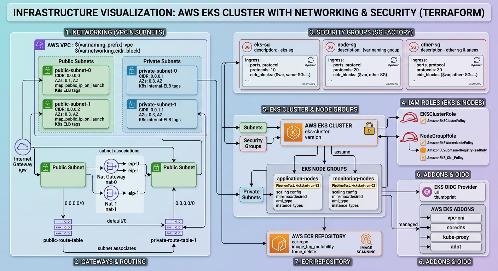

# AWS EKS Cluster Infrastructure via Terraform

This repository contains the Infrastructure as Code (IaC) written in Terraform to provision a highly available, secure Amazon EKS (Elastic Kubernetes Service) cluster along with its underlying networking, security components, and supporting services.

## 🗺️ Architecture Overview

Below is the conceptual architecture of the resources deployed by this Terraform configuration:

---

## What is Being Provisioned?

### Networking (VPC & Subnets)
* **Custom VPC** with a dedicated CIDR block.
* **Public Subnets** mapped to multiple Availability Zones (AZs) with Internet Gateway routing (tagged for Public ALBs/ELBs).
* **Private Subnets** configured for the EKS worker nodes (tagged for Internal ELBs).

### Gateways & Routing
* **Internet Gateway (IGW)** for outbound public traffic.
* **NAT Gateways + Elastic IPs** tied to public subnets to allow private instances secure outbound internet access.
* **Isolated Route Tables** for both public and private subnet mapping.

### Security Groups ("The SG Factory")
* A dynamic, dynamic-block driven Security Group generator that provisions custom ingress/egress rules for both the cluster control plane and node groups based on input variables.

### IAM Roles & Policies
* **EKS Cluster Role:** Grants Kubernetes control plane permission to manage AWS resources.
* **Node Group Role:** Configured with `AmazonEKSWorkerNodePolicy`, `AmazonEC2ContainerRegistryReadOnly`, and `AmazonEKS_CNI_Policy`.

### EKS Core & Node Groups
* **EKS Control Plane:** Managed Kubernetes master nodes running your specified version.
* **Managed Node Groups:** Auto-scaling worker node groups deployed strictly inside private subnets for security.

### Addons & Identity
* **OIDC Provider:** Enabled for IAM Roles for Service Accounts (IRSA).
* **Core Addons:** Deploys `vpc-cni`, `coredns`, `kube-proxy`, and `adot` dynamically.

### Elastic Container Registry (ECR)
* A private Docker container registry with image scanning on push enabled.

---

### Deployment Step
refer to:
https://mightycapstone.atlassian.net/wiki/spaces/ICDD/pages/7733251/mightycapstones-infra